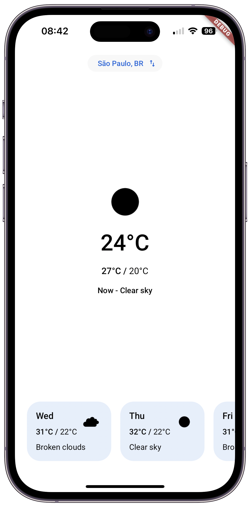
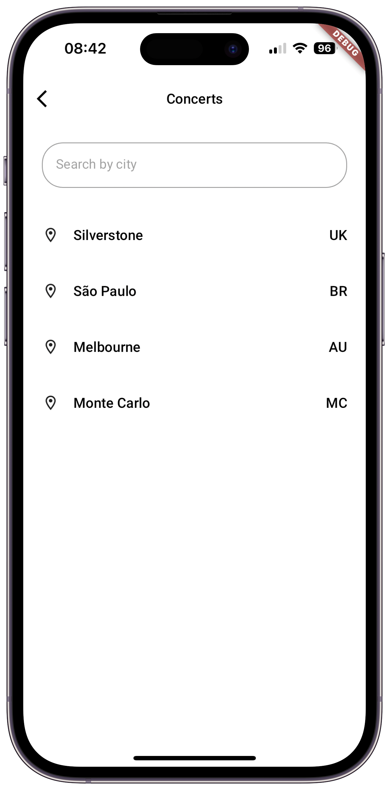

# Mobile Engineer Test #1 - Cloudwalt Weather

> The only way to go fast, is to go well.<br/>
> -- Robert C. Martin

# 1. Introduction

This project was developed with the aim of showcasing my technical skills, best practices in software development (Clean Code, Clean Architecture, and OOP) using the Flutter framework, following the requirements of the Mobile Engineer Test #1.

## App Features

The Cloudwalk Weather app offers the following main features:

1. **Current Weather and Forecast**: Users can view current weather conditions and a 5-day weather forecast for the selected location.

2. **Location List**: Users can search and select the city where the event will take place to view weather forecasts for that location.

3. **Offline Access**: The app allows users to access its features when not connected to the internet by displaying the last accessed information stored locally when the app was previously connected.

## App Screens

<div class="row">
    
    
</div>

<!-- {: style="height: 100"} -->

### Main Screen
The main screen displays various statuses, with the primary one being the current weather forecast for the selected city. It also shows a list with the weather forecast for the next 5 days.

### Search Screen
The search screen allows users to search and select cities where events will take place to view weather conditions and forecasts.

# 2. Getting Started

The app was developed using Flutter and was considered only for the iOS environment for this project.

During development, the app was tested on real devices (iPhone 15) and simulators (iPhone SE 1st Generation).

## Prerequisites

* To run this app, you need to have Dart and Flutter installed on your machine. You can install them from the official documentation, which you can find [here](https://docs.flutter.dev/get-started/install). This project was developed using Flutter (3.16.0) and Dart (3.2.0), so make sure to pay attention to the versions you'll use during execution.

* Since the app was developed for the iOS environment, it needs to be run on a MacOS operating system.

* During development, Xcode (Version 15.0) was used.

## Setting Up the Environment

The app uses external resources and APIs, so initial project configurations are necessary:

1. In the project root, create a .env file.

2. Add the following key to the .env file:

```bash
OPEN_WEATHER_API_KEY=<your-API-KEY>
```

3. Clean the project:

```bash
flutter clean
```

4. Install dependencies:

```bash
flutter pub get
```

5. Run the build command to build environment dependencies:

```bash
flutter pub run build_runner build
```

## Running the Application

1. Ensure you're running the program on a MacOS system.

2. Make sure the Xcode version you're using is up to date and that the app is "signed" with a team.

3. Run the Simulator (iOS emulator) on your machine, with an iOS system version equal to or greater than 14.0. It's recommended to use "iPhone 15".

4. In the project directory (the same directory as the pubspec.yaml file), run the command:

```bash
flutter pub get
```

5. Then, still in the same directory, to run the program on the Simulator, execute the command:

```bash
flutter run
```

Note: In case of any failures, run the command `flutter doctor` to check for any SDK or framework failures.

## Running Tests

To run the application tests, within the project, simply execute the command:

```bash
flutter test
```

# 3. Development

## Architecture

The project was developed using the layered architecture, inspired by the Clean Architecture book by Robert Cecil Martin. This architecture allows for test-driven development, with the creation of contracts and interfaces for classes, following single responsibility principles.

The layers are:

- data: containing sources, repositories, models, and mappers.

- domain: this layer contains entities, use cases, and repository abstractions.

- presentation: this layer contains the application interface, such as screens, widgets, controllers, etc.

In the presentation layers, the MVC (Model, View, and Controller) pattern was used, facilitating the integration of the interface with domain and model layers.

Functional programming was also used, facilitating information propagation across layers, as well as error handling and display to the user.

Finally, state management was developed, allowing the interface state to be changed through user interaction with the application.

## Git Flow


**Development:**
where continuous code development occurs. It's the main branch where new features are integrated before being promoted to releases.

**Feature**
where new features are developed in isolation. Each feature or set of features is developed in a separate feature branch, allowing for parallel development and specific code review.

**Release**
is created from the "development" branch when the code is ready to be prepared for a release. In this branch, final adjustments, bug fixes, and final testing are performed before a version is released to production.

**Master**
is the main branch of the repository, where stable and production-ready versions are maintained.

# 4. Packages

**dio: ^5.4.3+1**
- Library for making HTTP requests. Used to handle API calls efficiently and easily, allowing smooth communication between the app and APIs.

**get_it: ^7.6.7**
- Get_it is a dependency locator service that facilitates dependency management throughout the app. Used to inject dependencies cleanly and decoupled, promoting a more modular and testable architecture, as well as assisting in state management.

**hive: ^2.2.3**
- Hive is a NoSQL database library. Chosen for local storage of persistent data due to its simplicity and performance.

**hive_flutter: ^1.1.0**
- Hive_flutter is a Flutter-specific extension of Hive, providing native integration with the Flutter view layer. Used to ensure smooth synchronization between locally stored data and the app's user interface.

**google_fonts: '6.1.0'**
- Google Fonts is an easy and fast way to incorporate custom fonts into Flutter apps. Used to streamline the process of using fonts in the app, but it would also be possible to import fonts directly into the app's assets.

**envied: ^0.5.4+1**
- Envied is a tool that simplifies the management of environment variables in Flutter apps. Used to securely and organized manage sensitive variables, such as API keys. This package features obfuscation, offering more security compared to other available libraries.

**dartz: ^0.10.1**
- Dartz is a library that brings functional programming to Flutter, making it easier to write more concise and safer code. Used to handle asynchronous operations more elegantly and expressively using Either.

**rx_notifier: ^2.3.0**
- Rx_notifier is a library that creates a simplified abstraction of ValueNotifier within Flutter, making reactivity easier in apps. Used to create state management within the app, combined with get_it.

**go_router: ^14.0.2**
- Go_router is a routing library for Flutter that offers a simple and intuitive API for screen navigation. Used to manage app navigation declaratively and efficiently.

**intl: ^0.19.0**
- Intl is an official Flutter library for internationalization and localization of apps. Used to make the app accessible to a global audience, providing support for different languages and date/time formats.

**cached_network_image: ^3.3.1**
- Cached_network_image is a library that supports loading images from the internet with caching. Used to improve performance and user experience when displaying network images in the app, and also to display images in offline use cases.

**connectivity_plus: ^6.0.3**
- Connectivity_plus is a library that provides information about the device's network connection state. Used to ensure the app responds appropriately to changes in connectivity, offering a consistent experience to users.

**equatable: ^2.0.5**
- Equatable is a library that facilitates object comparison in Dart, making it simpler to implement semantic equality between them. Used to simplify the comparison of complex objects, improving code readability and maintainability.

**flutter_launcher_icons: ^0.13.1**
- Flutter_launcher_icons is a tool that simplifies the generation of app icons for different platforms. Used to automate the process of generating app icons, saving time and ensuring visual consistency.